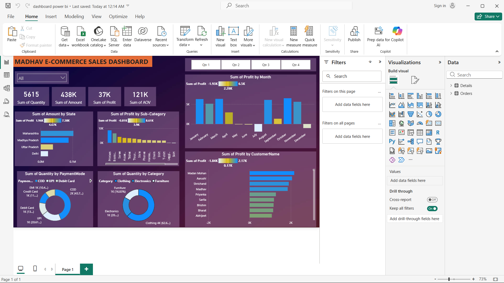

# 📊 Madhav E-Commerce Sales Dashboard (Power BI)

## 🧾 Objective
The owner of Madhav Store wants to analyze and track their online sales performance across India.  
The goal of this project is to build an interactive dashboard that provides meaningful insights into sales, profit, customer behavior, and regional performance.

---

## ⚙️ Tools Used
- Power BI  
- Power Query (for data cleaning & transformation)

---

## 🔄 Workflow
1. Imported raw sales data into Power BI  
2. Cleaned and transformed data using Power Query  
3. Structured data for analysis  
4. Built interactive visuals and dashboard  

---

## 📊 Key Features
- Total Sales, Profit, Quantity, and Average Order Value (KPIs)  
- Sales and Profit analysis by State  
- Category and Sub-category performance  
- Monthly Profit trends  
- Customer-wise profit analysis  
- Payment mode distribution  

---

## 🎛️ Interactivity
- Filters (Quarter, Category, etc.)  
- Dynamic visuals based on user selection  

---

## 💡 Insights Generated
- Identified top-performing states and categories  
- Observed monthly profit fluctuations  
- Analyzed customer contribution to profit  
- Understood preferred payment methods  

---

## 📌 Conclusion
This dashboard helps the business owner make data-driven decisions by providing a clear and interactive view of sales performance across different dimensions.

---

## 📷 Dashboard Preview

